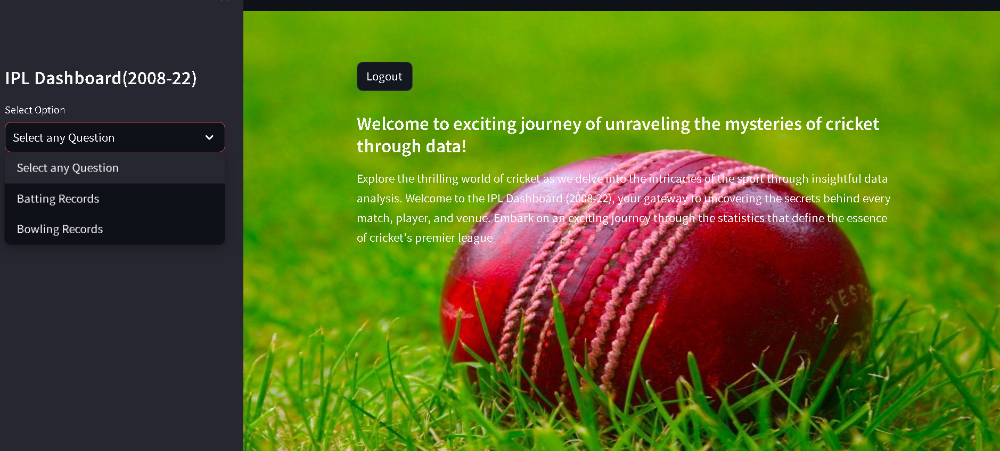
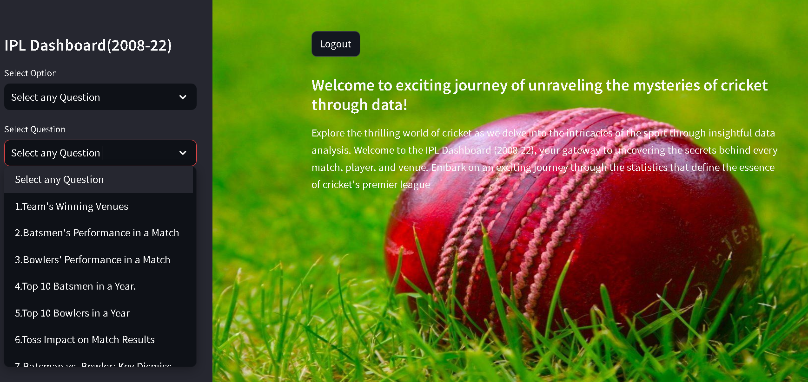
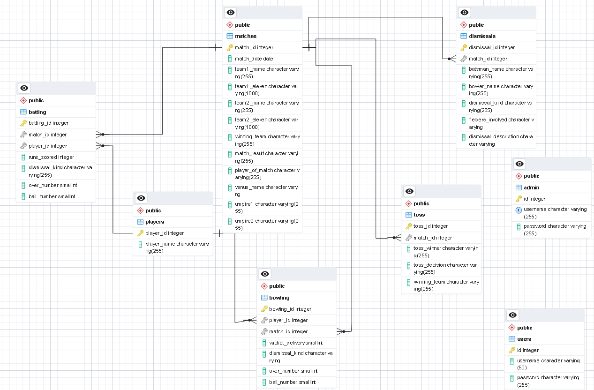
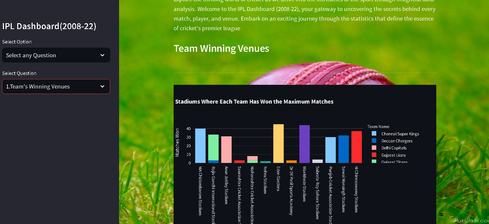

# 🏏 IPL Data Analysis Project

A complete data analysis and visualization pipeline built on IPL cricket data. The project includes data preprocessing, relational database design, and an interactive dashboard to explore insights from matches, players, and teams.

---

## ⚙️ Project Overview

This project involves:
- Cleaning and preprocessing IPL match data
- Creating a PostgreSQL database schema
- Feature engineering for player/match stats
- Building a Streamlit dashboard
- Visualizing insights using Python libraries

---

## 🧹 Data Preprocessing

Key steps:
- **Handled Missing Values**: City, Venue, Season, Team Names
- **Corrected Formats**: Fixed season format (2007/08 → 2008), name inconsistencies
- **Feature Engineering**:
  - Merged columns like `Kind + Fielders involved`
  - Computed winning margins (`wonby + margin`)
  - Aggregated data at match and player level

---

## 🧮 Database Schema

The PostgreSQL database schema organizes match, player, and performance information for structured querying and integration with visualization tools.

---

## 📊 Dashboard Overview

The interactive dashboard is built using **Streamlit**, enabling:
- Player-wise batting and bowling performance
- Team win/loss stats
- SQL-based custom queries with visualizations

---

## 🧰 Tools & Libraries Used

- **Data Preprocessing**: Pandas, NumPy (Google Colab)
- **Database Management**: PostgreSQL, VS Code, psycopg2
- **Visualization**: Matplotlib, Seaborn, Plotly
- **Dashboard**: Streamlit

---

